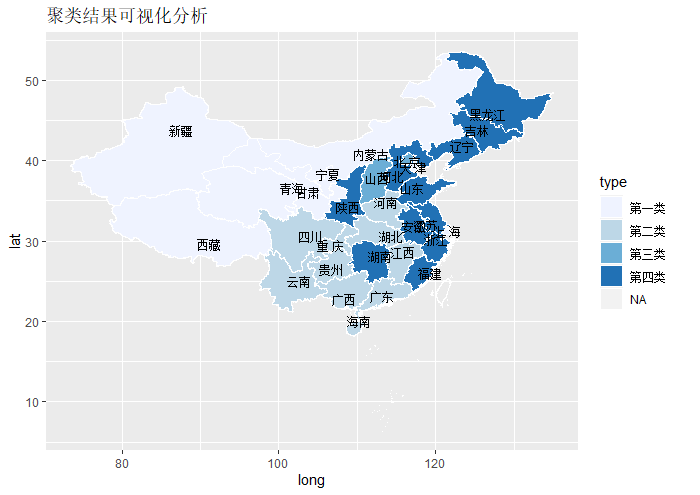

## **展示内容**


### 1.  绪论


### 2.  理论基础


### 3.  描述性统计

 
### 4.  实证分析


### 5.  结论及建议

# 1 绪论

## 1.1 研究背景

&emsp;&emsp;自2020年初中国武汉地区爆发新型冠状病毒肺炎疫情，并且在短期内迅速传播，发展成为全国性的传染疫情。新冠肺炎疫情将从总需求、总供给、通货膨胀等多个维度对经济增长产生负面冲击。

&emsp;&emsp;由于发生时间点处于春节假期，疫情直接影响了我国餐饮、交通、旅游等行业正常经营，抑制社会消费，阻碍了商品的正常流通，不可避免地导致社会消费品零售总额显著下滑。

&emsp;&emsp;其次,疫情对进出口也造成明显冲击。对比来看,美国、意大利等国疫情严重程度已远超我国,为有效控制疫情,多国均采取“封航”“封国”“封城”等措施,使得全球贸易活动锐减甚至停滞,对全球产业链的正常运转造成重创,一旦持续时间过长可能造成部分产业链断裂,对我国进出口行业影响巨大。

&emsp;&emsp;此外，疫情爆发对供给产生的负面冲击、生活必需商品和服务的需求刚性，叠加因供给原因生猪价格在上半年可能持续上涨的影响，预计居民消费价格指数将面临较大的上涨压力。

## 1.2 文献综述

- 肖学培.季节性ARIMA模型对社会消费品零售总额的建模和预报[J].2019.<br/>
&emsp;&emsp;通过建立季节性ARIMA模型来预测2019年各月的社会消费品零售总额情况。

- 黄薇. 灰色马尔可夫模型在中国与东盟进出口总额预测中的研究与应用.2010.<br/>
&emsp;&emsp;证明了用灰色马尔可夫模型预测进出口总额的预测精确度高于灰色预测模型,,灰色模型和马尔可夫链的结合可以避免考虑其他多种影响因素,同时又可以预测未来一段时间的变化,具有较大的科学性和实用性。（具有较高的实际应用价值）

- 马永梅,林天水.基于我国居民消费价格指数的聚类分析[J]. 2019.<br/>
&emsp;&emsp;以2016年我国31个省市自治区的CPI价格指数为研究对象,利用谱系图确定聚类的个数,并构建评价函数改进初始聚类中心,聚类结果显示把31个地区分为四类比较合适, 最后结合我国当前的发展形势对不同类别地区提出相应的价格控制建议。

## 1.3 研究思路与方法
1.预测分析。本次研究采用2008年到2019年我国社会消费品零售总额和进出口总额月度数据，分别建立乘积季节模型和灰色马尔可夫模型，对2020年1-4月份进行预测，并与实际数值进行对比分析，量化分析疫情带来的经济影响。

<br/>
2.聚类分析。本次研究首先采用2020年2月我国31个省市自治区直辖市的八大类商品居民消费价格指数为研究对象进行聚类分析；其次，对聚类结果进行综合分析并提出建议。

<br/>
本文综合应用乘积季节模型，灰色马尔可夫模型及聚类分析等方法，对我国消费、进出口等相关数据进行分析，并预测新冠肺炎疫情对消费、对外贸易、物价的影响及对策分析。


## 1.4 数据来源
研究中的数据来自:
<br/>
&emsp;&emsp;[国家统计局]
http://data.stats.gov.cn/easyquery.htm?cn=A01


# 2 理论基础

## 2.1 时间序列的的相关理论

### 2.1.1 时间序列概述

&emsp;&emsp;时间序列主要是通过观察某一现象随着时间的变化所呈现出来的变动，是动态过程。它不仅能够展示出现象随时间发展变化的动态趋势，还可以预测该现象的发展方向和未来前景。

----

### 2.1.2 季节ARIMA模型介绍

- 季节ARIMA模型

&emsp;&emsp;有些非平稳序列不仅带有趋势，而且经常依时间而呈现的周期性变化，通常称一个序列呈现以s(s为一正整数)为周期的季节ARIMA模型。

&emsp;&emsp;一般季节ARIMA模型的表达式为：$$\phi_{p} (L)\Phi _{p}(L^{s})\bigtriangledown ^{D}\bigtriangledown ^{d}x_{t}=\theta_{q} (L)\Phi _{Q}(L^{s})\mu_{t}$$

----

### 2.1.3 建模流程

**(1)序列平稳性检验**

&emsp;&emsp;为了模型可以顺利建立，必须要对其平稳性进行检验。对非平稳的时间序列，我们可以先对序列进行对数或差分处理。

**(2)模型的识别**

&emsp;&emsp;根据ACF与PACF图确定 p,q 的值：

| acf值 |pacf值|模型| 
|:-:|:-:|:-:|
| 拖尾（逐渐减为0） | P阶截尾（p阶快速减为0）|ARIMA(p,d,0)| 
| q阶截尾 | 拖尾 |ARIMA(0,d,q) | 
| 拖尾 | 拖尾 |ARIMA(p,d,q)|

----

**(3)参数估计**

&emsp;&emsp;确定模型阶数后，应对模型进行参数估计。本文采用最小二乘法OLS进行参数估计，确定出模型的参数。

**(4)模型检验**

&emsp;&emsp;一是检验模型参数的估计值是否具有显著性; 二是检验模型的残差序列是否为白噪声。

**(5)模型预测**

&emsp;&emsp;根据建模分析结果，得到最优模型，据此进行预测研究，判断原始序列的未来走向和发展。


## 2.2灰色马尔科夫的相关理论

### 2.2.1灰色马尔科夫概述

&emsp;&emsp;灰色系统预测主要用于时间短、数据资料少、波动不大的预测问题。马尔可夫链反映了各种随机因素的影响程度,适合于随机波动性较大的预测问题，但要求时间序列具有平稳过程的特点,然而预测对象常常是随时间变化而呈现某种变化趋势的非平稳随机过程，这样正好采用灰色GM(1,1)模型对时间序列进行拟合，找出其变化趋势。

----

### 2.2.2灰色马尔科夫建模流程

**(1)预测状态的划分**

&emsp;&emsp;根据灰色模型得到的拟合值和真实值计算残差相对值，依据残差相对值进行状态的划分，确定原始序列所处的状态。

**(2)状态转移概率矩阵的创建**

&emsp;&emsp;计算转移频数矩阵和一步转移概率矩阵，并对序列进行马氏性检验。如果序列没有通过马氏性检验，则不能建立马尔科夫模型；反之，则计算n步转移概率矩阵来确定下一时刻所处状态。

----

**(3)预测值的计算**

&emsp;&emsp;利用该式修正灰色模型的拟合预测值。$$\tilde{X}^{(0)}(k)=\frac{1}{2}\times(\frac{\hat{X}^{(0)}(k)}{1-\varepsilon_{1}(k)}+\frac{\hat{X}^{(0)}(k)}{1-\varepsilon _{2}(k)})$$


## 2.3 K均值聚类的相关理论
### 2.3.1 K-mean算法概述

&emsp;&emsp;K-means算法的基本思想为对于给定的样本集，按照样本之间的距离大小，将样本集划分为K个簇。让簇内的点尽量紧密的连在一起，而让簇间的距离尽量的大，两个对象之间的距离越近，相似性越高。聚类的结果就是使类内部的同质性高，而类之间的异质性高。

----

### 2.3.2 K-mean算法步骤

- 第一步，输入聚类数目K和待分类数据集。在K-Means聚类中，要根据最终的聚类效果，实际选取K值。

- 第二步，确定K个初始类质心。常见的初始类质心的指定方法有：

&emsp;&emsp;(1)经验选择法，即根据以往经验大致了解聚类数目；

&emsp;&emsp;(2)随机选取法，即随机指定K个样本观测点作为初始类质心；

&emsp;&emsp;(3)最小最大法，即先选择所有观测点中相距最远的两个点作为初始类质心，然后选择第三个观测点，它与已确定的类质心的聚类是其余点中最大的。然后按照同样的原则选择其他类质心。

----

- 第三步，根据欧几里得距离来判断相似度量，判断每个对象数据属于哪个类。
- 第四步，重新确定K个类质心。重新计算K个类的质心（类中各观测点均值），并以该均值点作为新的类质心。
- 第五步，计算出准则函数E。聚类准则函数E用于判断聚类质量的高低,误差平方和准则函数E的值在算法的每次迭代过程中逐渐减小,最终收敛至一个固定的值,这时算法迭代结束。
- 第六步，循环三、四、五步直到准则函数E在允许的误差范围内。


# 3 描述性统计
## 3.1 疫情描述性统计
&emsp;&emsp;从图中可以看出，累计确诊人数从2月份开始迅速增加，但是从3月份开始增速变缓。累计死亡人数曲线总体来看较为平稳，每日间的差异并不大。累计治愈人数从2月份开始增加，同样3月份开始增速相对下降。
<div align=center>

</div>

## 3.2 社会消费品零售总额描述性统计
&emsp;&emsp;从图中可以看出，随着时间的推移社会消费品零售总额整体显示出逐年上升的趋势。
<div align=center>

</div>

## 3.3 进口、出口描述性统计
&emsp;&emsp;由图可得出，进口、出口序列均呈现出逐年上升的趋势，且存在着季节性。2020年3月份的进口、出口额较2019年有所减少。

<div align=center>

</div>

# 4 实证分析

## 4.1 社会消费品零售总额

&emsp;&emsp;通过对2008-2019年社会消费品零售总额月度数据建立SARIMA模型，预测2020年1-4月份月度数据。

### 4.1.1 平稳性检验
<div align=center>

</div>
<div align=center>

</div>

----

### 4.2.2 模型定阶

&emsp;&emsp;绘制差分后的自相关与偏相关图

<div align=center>

</div>

&emsp;&emsp;最终选取模型为：ARIMA(2,1,1)(0,1,0)[12]。

----

### 4.2.3 模型建立与预测

&emsp;&emsp;(1) 模型的参数估计

|参数  | ar1 | ar2 | ma1 |
|:-:|:-:|:-:|
| coefficients | -0.25 | -0.22 | -0.05 |
| s.e | 0.35 | 0.12 | 0.35|
<br/>

&emsp;&emsp;(2) 模型的适应性检验:残差的正态性检验通过; LB统计量的p值为0.9603>0.05，白噪声检验通过。

----

&emsp;&emsp;(3) 利用SARIMA模型进行预测

| 时间 | 预测值 | 置信区间 | 
|:-:|:-:|:-:|
| 2020.01 | 34022.76 |	(25261.69, 42783.83) | 
| 2020.02 | 34039.79 |	(25278.91, 42800.68) | 
| 2020.03 | 32900.22 |	(24139.39, 41661.05) |
| 2020.04 | 35270.23 |	(26509.40, 44031.06) |

----

<div align=center>

</div>
<br/>
&emsp;&emsp;2020年1-2月，3月和4月损失率分别为23%，20%，20%，1-2月份社会消费品零售总额经济损失比较大，3月，4月的损失率有所缓解。

## 4.2 进口总额

### 4.2.1 GM(1,1)模型

&emsp;&emsp;根据灰色系统理论，对2008-2019年进口总额开方数据建立灰色GM(1,1),模型结果如下：

&emsp;&emsp;GM(1,1)参数估计值: 发展系数-a= 0.02 &emsp;灰色作用量u= 33.71 

&emsp;&emsp;残差检验：平均相对误差= 5.40 % &emsp;模型精度= 94.60 %

&emsp;&emsp;后验差比值检验: C值= 0.29&emsp;C值<0.35, P>0.95, GM(1,1)预测精度等级为：优

----

### 4.2.2 灰色马尔科夫模型

&emsp;&emsp;1.残差相对值序列的状态划分为：(-12.7%,-3.5%],(-3.5%,2.5%],(2.5%,8%]

&emsp;&emsp;2.一步转移概率矩阵：
$$P=(p_{ij})_{3\times 3}=\begin{pmatrix}
0.33 &0.67  &0 \\ 
0.33 &0  &0.67 \\ 
0.2 &0.2&0.6 
\end{pmatrix}$$
&emsp;&emsp;马氏性检验:$\chi ^{2}=17.98> \chi _{0.05}^{2}\left ( 4 \right )=9.49$,满足马氏性。

&emsp;&emsp;3.修正灰色模型的拟合预测值,模型精度为96.35%。与灰色GM(1,1)模型相比，模型精度提高了6.33%。

&emsp;&emsp;4.由一步转移概率预测2020年进口总额：24365.10亿美元。根据各月比例，预测2020年1-2月、3月和4月进口额。

----

<div align=center>

</div>
<br/>
&emsp;&emsp;2020年1-2月，3月和4月的进口总额损失率分别为13%，19%，24%。其中3，4月份影响较大。


## 4.3 出口总额

### 4.3.1 GM(1,1)模型

&emsp;&emsp;根据灰色系统理论，对2008-2019年出口总额开方数据建立灰色GM(1,1),模型结果如下：

&emsp;&emsp;GM(1,1)参数估计值: 发展系数-a= 0.03 &emsp;灰色作用量u= 35.07 

&emsp;&emsp;残差检验：平均相对误差= 4.63 % &emsp;模型精度= 95.37 %

&emsp;&emsp;后验差比值检验: C值= 0.29&emsp;C值<0.35,P>0.95, GM(1,1)预测精度等级为：优

----

### 4.3.2 灰色马尔科夫模型

&emsp;&emsp;1.残差相对值序列的状态划分为：(-15.5%,-8.2%],(-8.2%,0.9%],(0.9%,6.5%]

&emsp;&emsp;2.一步转移概率矩阵：
$$P=(p_{ij})_{3\times 3}=\begin{pmatrix}
0 &1  &0 \\ 
0.2 &0.6  &0.2 \\ 
0 &0.2&0.8 
\end{pmatrix}$$
&emsp;&emsp;马氏性检验:$\chi ^{2}=12.87> \chi _{0.05}^{2}\left ( 4 \right )=9.49$,满足马氏性。

&emsp;&emsp;3.修正灰色模型的拟合预测值,模型精度为95.22%。与灰色GM(1,1)模型相比，模型精度提高了3.83%。

&emsp;&emsp;4.由一步转移概率预测2020年出口总额：26139.94亿美元。根据各月比例，预测2020年1-2月、3月和4月出口额。

----

<div align=center>

</div>
<br/>
&emsp;&emsp;2020年1-2月，3月和4月损失率分别为19%，6%，4%，出口总额的"经济损失"逐渐下降。


## 4.4 居民消费价格指数的聚类分析

### 4.4.1 研究内容
<br/>
&emsp;&emsp;居民消费价格指数简称为CPI，是反映与居民生活有关的商品及劳务价格统计出来的物价变动指标，它是在特定时段内度量一组代表性消费商品及服务项目的价格水平随时间而变动的相对数。我国居民消费价格指数按照商品类别可以划分为八大类，分别是食品烟酒、衣着、居住、生活用品及服务、交通和通信、教育文化和娱乐、医疗保健、其他用品和服务。

&emsp;&emsp;本次研究以2020年2月我国内地31个省市自治区直辖市的八大类商品居民消费价格指数为研究对象，利用SSE原则确定最佳聚类个数进行聚类分析，得到聚类结果，对各类地区物价水平进行综合分析。

----

### 4.4.2 K均值聚类

(1) 确定聚类个数
<br/>
&emsp;&emsp;本次研究中采用的指标是组内平方和（SSE）来确定最佳聚类个数。组内平方和SSE会随着聚类个数的增加逐渐减小，当SSE较小程度不明显时，认为此时的聚类个数为最佳聚类个数，在这里，根据SSE原则确定的聚类个数为四类。

(2) 欧式距离进行聚类
<br/>
&emsp;&emsp;当K=4时，根据初始确定的类中心，计算各个样本到聚类中心的欧式距离，根据距离将对象分配到距离最近的群中，重新计算各个类的中心。

(3) 聚类结果
<br/>
&emsp;&emsp;重复进行步骤2，当类中心不再变化时输出聚类结果。根据K均值聚类，最终将31个地区划分为四类。

----

### 4.4.3 聚类结果分析

&emsp;&emsp;根据K均值聚类，最终将31个地区划分为四类。聚类结果如下；

| 类  别 | 省 份 | 
| ------ | ------ |
| 第一类 | 天津市，上海市，内蒙古自治区，西藏自治区，甘肃省，青海省，宁夏回族自治区，新疆维吾尔自治区 |
| 第二类 | 江西省，河南省，湖北省，广东省，广西壮族自治区，海南省，重庆市，四川省，贵州省，云南省 |
| 第三类 | 北京市，山西省 |
| 第四类 | 河北省，山东省，陕西省，辽宁省，吉林省，黑龙江省，江苏省，浙江省，安徽省，福建省，湖南省 |

----

```{r,include=FALSE}
knitr::opts_chunk$set(echo =FALSE,results ="hide")
library(jsonlite)
library(rjson)
library(RJSONIO)
library(ggplot2)
library(RColorBrewer)
library(lubridate)
library(plyr)
library(dplyr)
library(sp)
library(rgdal)
library(maptools)
china=readOGR('C:/Users/LENOVO/Desktop/chinaprovinceborderdata_tar_gz/china-province-border-data/bou2_4p.shp')
chinamap<-fortify(china)
x <- china@data
xs<-data.frame(x,id=seq(0:924)-1)
china_mapdata<-join(chinamap, xs, type = "full")
unique(china@data$NAME)
fl=read.csv("C:/Users/LENOVO/Desktop/map.csv",sep=",")
capdate=read.csv("C:/Users/LENOVO/Desktop/province.csv",header=TRUE,sep=",")

totalconfirm=data.frame(NAME=fl$NAME,
      type=cut(fl$type,breaks=c(1,2,3,4,5),
      labels=c("第一类","第二类","第三类","第四类"),
        order = TRUE,include.lowest = T,right = F))

df_map<-join(china_mapdata,totalconfirm,type="full")
``` 

```{r,include=FALSE}
p=ggplot(df_map)+
        geom_polygon(aes(x=long,y=lat,group=group,fill=type),
        colour="white")+
        labs(title="聚类结果可视化分析")+
    geom_text(aes(x=JD,y=WD,label=province),data=capdate)+
    scale_fill_manual(values = brewer.pal(4,"Blues"))
print(p)
```      
<div align=center>

</div>

----

&emsp;&emsp;接下来，我们绘制出了各类类中心的变化折线图：
<br/>

<div align=center>

</div>

- 在八大类的接个指数中，所有地区的食品烟酒价格指数比较高，交通运输价格指数最低。


# 5 结论及建议

## 5.1 研究结论
<br/>
1.社会消费品零售总额
<br/>
&emsp;&emsp;1-2月份社会消费品零售总额经济损失为23%，3月疫情得到了基本控制，陆续开始复工复产，3月，4月的损失率有所缓解。
<br/>
<br/>
2.进口总额、出口总额
<br/>
&emsp;&emsp;1-2月我国进口总额损失率为13%，3月以来疫情逐步在海外蔓延，我国进口总额仍然受到很大影响，损失率仍然增加。
<br/>
&emsp;&emsp;1-2月我国出口总额损失率为19%，3月以来逐步推进复工复产，外贸企业集中出货，医疗物资大量出口，出口总额得到改善。
<br/>
<br/>
3.居民消费价格指数
<br/>
&emsp;&emsp;疫情期间食品烟酒类、医疗类价格水平有所上升，在控制物价同时应稳定物资供给，保障基本民生。

## 5.2 建议

&emsp;&emsp;科学的应对措施，可以为中国打赢疫情防控阻击战，快速恢复国民经济运行的正常秩序，稳步迈向经济高质量发展轨道提供重要支持和有力保障。
<br/>
（一）优化政策组合
<br/>
1.采取更加积极的财政政策
<br/>
&emsp;&emsp;对疫情冲击，建议采取更加积极的财政政策。一方面，进一步减税降费，减少中小企业的税收负担，对与国计民生密切相关的企业给予直接补贴；另一方面，进一步加大财政支出，增加对医疗、文化、教育等基础设施领域的项目投资，提升国民需求，推动经济高质量发展。

2.采取稳健灵活的货币政策
<br/>
&emsp;&emsp;当前疫情，可考虑稳健灵活的货币政策，进一步降低基准利率、下调存款准备金率，释放短期的流动性，降低融资成本，稳定市场预期，帮助中小企业渡过难关。

----

（二）积极扩大内需
<br/>
<br/>
1.稳定就业和物价，保障基本民生
<br/>
&emsp;&emsp;企业可利用行业转型进行线上招聘，利用互联网新增就业岗位。同时要有序恢复农牧种植业，减少疫情对农产品供给的影响，严厉打击哄抬物价、恶性竞争等投机行为，稳定物价，保障基本民生。

2.有序推进复产复工
<br/>
&emsp;&emsp;虽然疫情总体形势得到有效控制，但仍需保持高度警惕。建议针对不同地区采取差异化的复工政策，高风险地区仍要注意疫情防控，中风险地区要适时安排复工，低风险地区要尽快恢复产业产能。针对不同企业、不同行业有序开展企业复产复工，积极支持受疫情冲击严重的零售、餐饮、住宿、旅游等重点服务行业恢复。

3.充分挖掘消费潜力
<br/>
&emsp;&emsp;从市场供给、消费升级等方面促进消费扩容提质。适当放松限购，减免购置税，发放补贴券等方式，进一步激活市场消费；加大线上消费模式推广力度，进一步挖掘三四线城市、乡村地区消费潜能。

----

（三）稳定外贸市场
<br/>
<br/>
1.推动完善国内市场
<br/>
&emsp;&emsp;面对外部环境变化的冲击，中国持续推动开放，持续推动完善营商环境，向世界释放明确的开放信号，为疫情下国际投资获得安全产业环境。

2.提高企业自身竞争力
<br/>
&emsp;&emsp;外贸企业应为疫情之后的市场开拓做好准备，加强新产品、新技术研发，对企业员工进行培训，充分利用电子商务等线上平台和渠道拓宽市场，调整产业结构扩大商品出口。


---

 &nbsp;

 &nbsp;
 
<center><center>
&nbsp;

<font size=16><center>谢谢大家！<center></font>

