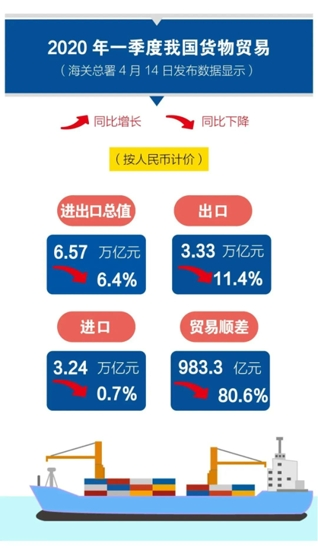

# 1 研究介绍

## 1.1 研究背景

&emsp;&emsp;新冠肺炎疫情爆发以来,在党中央国务院的坚强领导下,全国上下实施的超强抗击疫情措施取得了显著成效,然而大范围企业停工与全国范围超常强制性隔离措施也带来了巨大经济代价,给各行各业都造成了不同程度的影响。

&emsp;&emsp;目前关于新冠肺炎疫情影响的研究主要聚焦在两个方面:

&emsp;&emsp;一是基于宏观视角分析疫情对我国产生的影响；

&emsp;&emsp;二是从中观层面剖析疫情冲击下产业发展面临的困境。

&emsp;&emsp;居民消费可以直接反映人民生活状况，疫情的全球化蔓延也影响着我国对外贸易，研究疫情对我国经济的影响具有重要意义。

## 1.2 文献综述

- 郑江淮等（2020）通过对“非典”前后的宏观经济和消费形势复盘，比较了新冠肺炎疫情与“非典”疫情分析新冠肺炎疫情对消费经济造成的潜在影响。

- 韩玉锦等（2020）从社会消费品零售总额这一指标分析, 采用灰色预测模型测算此次疫情对该指标的影响大小。

- 刘夏等（2019）分布采用ARIMA模型和灰色马尔科夫模型对2012-01—2017-12月三亚的交通流量进行拟合仿真,并对2018年每月的客流进行了趋势外推预测。

- 肖学培等（2019）通过建立季节性ARIMA模型来预测2019年各月的社会消费品零售总额情况。 

----

- 何海阔等（2018）应用灰色模型和乘积季节模型预测承德市布鲁菌病的发病趋势, 发现乘积季节模型对布鲁菌病的预测效果更好。

- 黄薇（2010）证明了用灰色马尔可夫模型预测进出口总额的预测精确度高于灰色预测模型,具有较高的实际应用价值。

目前存在的问题

- 由于不同研究选择不同的经济指标，会使得研究结论有所不同。
- 随着时代变迁和客观条件的改变，2020年突发的新冠疫情使得研究的背景与以往也不同。

&emsp;&emsp;因此，为探究此次疫情的影响程度，本文从宏观经济指标分析，测算此次疫情对我国消费及进出口影响大小。

## 1.3 描述性统计分析
### (1) 社会销售品零售总额
&emsp;&emsp;随着我国社会生产力的提高，人们消费水平的提升，我国社会消费品零售总额持续上升，增速总体呈波动下降趋势。

----

----

### (2) 疫情对出口影响大于进口，贸易顺差同比大幅收窄。

## 1.4 研究主题
 
 
 
&emsp;&emsp;本文综合应用灰色马尔可夫预测模型和季节ARIMA模型等方法，对我国消费、进出口相关数据进行分析，并预测新冠肺炎疫情对消费经济、对外贸易的影响及对策分析。

## 1.5 研究方法

### 乘积季节模型

- 简单季节模型可以将序列平稳化，并且平稳化后的序列可以拟合ARMA模型。
- 但不能充分提取其中的相关关系，这时需要采用乘积季节模型$ARIMA(p,d,q)\times (P,D,Q)_{s}$

---

### 灰色马尔可夫模型

- 灰色系统预测主要用于时间短、数据资料少、波动不大的预测问题。
- 马尔可夫链反映了各种随机因素的影响程度,适合于随机波动性较大的预测问题，但要求时间序列具有平稳过程的特点,然而预测对象常常是随时间变化而呈现某种变化趋势的非平稳随机过程，这样正好采用灰色GM(1,1)模型对时间序列进行拟合，找出其变化趋势。

# 2 季节乘积模型的构建
## 2.1 社会消费品零售总额的SARIMA模型
### 2.1.1 数据平稳性检验
&emsp;&emsp;首先查看原始序列，判断平稳性。

&emsp;&emsp;观察时序图，可以发现数据具有周期性、长期增长的趋势，并非在某一个常数上下波动，因此判断该序列为非平稳时间序列。应当对该序列进行差分处理，检验差分后的序列是否平稳。

----
&emsp;&emsp;首先进行一阶差分，差分后的时序图没有明显的线性趋势，且差分后p值为0.01小于0.05说明序列已平稳，但仍能看到周期为12的周期性，所以加入季节性因子，考虑12阶差分。

&emsp;&emsp;接下来进行12阶差分，发现12阶差分后，序列中季节性影响已被剔除。

----
### 2.1.2 模型定阶

&emsp;&emsp;绘制12阶差分后的自相关与偏相关图

- ACF与PACF图大致呈正弦衰减趋于零，表现为拖尾。确定模型ARIMA(p,d,q)。
- 对于非季节性，自相关图在滞后1阶缩小为0，确定q=1；偏相关图滞后1阶和2阶超出了虚线位置，且在2阶后截断，因此确定p=2。
- 对于季节项，查看lag12、24处是否超出虚线位置，从PACF看出P=0，从ACF看出Q=0，选取模型为：ARIMA(2,1,1)(0,1,0)[12]。

----
### 2.1.3 模型建立与预测
&emsp;&emsp;(1) 模型的参数估计
 
 
&emsp;&emsp;利用最小二乘的方法对模型的参数进行了估计，各变量的系数如下表所示：

----
&emsp;&emsp;(2) 模型的适应性检验

&emsp;&emsp;参数估计后，对模型做适应性检验。判断残差是否是平均值为零且方差为常数的正态分布且检验残差序列是否为白噪声序列。

- 从残差分布图中可以看出残差的正态性检验通过。
- 残差的白噪声检验，LB统计量的p值为0.9603>0.05，拒绝原假设，认为残差是独立的。因此模型的两个检验均通过，模型拟合效果不错。

----
&emsp;&emsp;(3) 利用SARIMA模型进行预测
 
 
&emsp;&emsp;预测未来6个月社会消费品零售总额的值，得到如下预测值：

----
&emsp;&emsp;绘制模型的拟合值与原始数据真实值的对比图，可看出几乎所有的预测值都与原始数列的值重合，且拟合值符合数据趋势规律。

## 2.2 出口总额的SARIMA模型
### 2.2.1 数据平稳性检验
&emsp;&emsp;绘制出口总额原始时间序列的时序图，初始判断序列是否平稳。

&emsp;&emsp;从图中可以看出该序列呈上升趋势具有存在季节影响，且p值为0.1121未通过单位根检验，因此该序列为非平稳时间序列。需要差分。经过一阶差分和季节差分后，p值为0.01，可认为模型剔除了趋势，基本平稳。

----
### 2.2.2 模型定阶
&emsp;&emsp;根据12阶差分后的自相关与偏相关图定阶。

- ACF与PACF图均为拖尾。
- 对于非季节性，根据自相关图确定q=1；偏相关图确定p=2。
- 对于季节项，从PACF看出P=2，从ACF看出Q=2，因此季度参数设置为(2,1,2)，确定模型为：ARIMA(2,1,1)(2,1,2)[12]。

----
### 2.2.3 模型建立与预测
&emsp;&emsp;(1) 模型的参数估计
 
 
&emsp;&emsp;建立模型，得到各变量回归系数。
 
 

----

&emsp;&emsp;(2) 模型的适应性检验
 
 
&emsp;&emsp;接下来检验模型的正态性与随机性。

- 从直方图可以看出残差大致是服从正态分布的。

- 残差的白噪声检验的p值为0.9916大于0.05，反映出该残差是纯随机序列，该序列建模成功。

----
&emsp;&emsp;(3) 利用SARIMA模型进行预测
 
 
&emsp;&emsp;依据Arima(2,1,1)（2,1,2）[12]模型预测出口总额未来6个月的数值，结果如下：

----
&emsp;&emsp;对比真实值与预测值之间的差异，发现预测值与真实值之间相差不大，说明预测效果良好。

## 2.3 进口总额的SARIMA模型
### 2.3.1 数据平稳性检验
&emsp;&emsp;绘制进口总额原始时间序列的时序图，检验其平稳性。

&emsp;&emsp;由图可得进口总额序列存在季节性和上升趋势，且其单位根检验p值为0.6204大于0.05，因此该序列是非平稳的。对其一阶差分和季节差分后的p值为0.01，通过了单位根检验，此时序列已平稳。

----
### 2.3.2 模型定阶
&emsp;&emsp;根据12阶差分后的自相关与偏相关图定阶。

- ACF图表现为拖尾，PACF图表现为截尾。
- 非季节性：根据偏相关图确定p=2。
- 对于季节项：从PACF看出P=0，从ACF看出Q=1，模型确定为：ARIMA(2,1,0)(0,1,1)[12]。

----
### 2.3.3 模型建立与预测
&emsp;&emsp;(1) 模型的参数估计

&emsp;&emsp;根据最小二乘法建立回归模型，回归结果如下表所示：

----
&emsp;&emsp;(2) 模型的适应性检验

&emsp;&emsp;评价模型，检验模型是否可用于预测。

- 残差分布基本与正态分布吻合。
- Box-test检验p值为0.9051大于0.05，通过了残差独立性检验，该序列建模成功。

----
&emsp;&emsp;(3) 利用SARIMA模型进行预测

&emsp;&emsp;预测2019年7月-2019年12月进口总额的值，得到如下预测值：

----
&emsp;&emsp;绘制模型的拟合值与原始数据真实值的对比图，由图可得，预测值基本围绕在真实值附近，预测值也在误差范围内，预测结果合理。

# 3 灰色马尔科夫模型的构建

## 3.1 社会消费品零售总额

### 3.1.1 灰色GM(1,1)模型

- 模型预测评估步骤

&emsp;&emsp;1.使用灰色理论建立GM（1,1）模型，并从2008-2018年社会消费品零售总额均值预测2019年的均值。

&emsp;&emsp;2.通过历史数据，可以计算出每月社会消费品零售总额和进出口值与全年总数之间的关系，以预测2019年每月社会消费品零售总额，并计算模型的平均相对误差。

----

- 原始数据检验及处理

&emsp;&emsp;建立灰色模型前，首先对原始数据进行级比检验和光滑度检验。

&emsp;&emsp;设原始数据序列为：$X^{\left ( 0 \right )}= \left ( x^{\left ( 0 \right )}\left ( 1 \right ),x^{\left ( 0 \right )}\left ( 2 \right ),\cdots ,x^{\left ( 0 \right )}\left ( n \right )\right )$

&emsp;&emsp;计算级比：$\sigma (k)=\frac{X^{(0)}(k-1)}{X^{(0)}(k)}(k=2,3,\cdots ,n)$

&emsp;&emsp;如果所有级比都在$(e^{-\frac{2}{n+1}},e^{\frac{2}{n+1}})$范围之内，则可以对原始数据直接建立灰色模型。

&emsp;&emsp;计算光滑比：$\rho (k)=\frac{X^{(0)}(k)}{X^{(1)}(k-1)}(k=2,3,\cdots ,n)$

&emsp;&emsp;当原始序列数据满足$\rho (k)$是k的递减函数时，才可以用于建模预测。

----

----

----

- 建立灰色GM(1,1)模型

&emsp;&emsp;根据灰色模型的理论，对我国2008-2018年社会消费品零售总额开方数据建立灰色GM(1,1)模型，并对模型进行残差检验，后验差检验和模型预测。

&emsp;&emsp;对2008-2018年开方数据建立灰色GM(1,1)模型结果：

&emsp;&emsp;GM(1,1)参数估计值: 发展系数-a= 0.05909474&emsp;灰色作用量u= 104.1182 

&emsp;&emsp;残差检验：平均相对误差= 2.040697 %&emsp;模型精度= 97.9593 % 

&emsp;&emsp;后验差比值检验: C值= 0.07793365&emsp;C值<0.35,P>0.95, GM(1,1)预测精度等级为：优

----

&emsp;&emsp;将灰色GM(1,1)模型的拟合值平方还原后，与真实值比较。

&emsp;&emsp;平均相对误差计算公式：$\bar{\Phi }= \frac{1}{n}\sum_{i=1}^{n}\frac{\left | X^{(0)}(i)-\hat{X}^{(0)}(i) \right |}{X^{(0)}(i)}$

&emsp;&emsp;精度计算公式：$\rho=1-\bar{\Phi}$

&emsp;&emsp;计算2008年-2018年社会消费品零售总额的拟合平均相对误差为3.7449%，模型精度为96.2551%，模型精度较高。

----

### 3.1.2 灰色马尔科夫模型

&emsp;&emsp;灰色马尔科夫模型是利用马尔科夫模型对灰色模型的预测值进行修正，从而提高拟合和预测精度。具体步骤如下：

&emsp;&emsp;1.对原始数据建立灰色模型，求出拟合值，计算残差相对值。然后对残差相对值序列进行状态划分，确定原始序列所处的状态。

&emsp;&emsp;残差相对值序列的状态划分为：(-6.5%,-3.5%],(-3.5%,0.1%],(0.1%,3%]

----

----

&emsp;&emsp;2.计算转移频数矩阵和一步转移概率矩阵，并对序列进行马氏性检验。若通过马氏性检验，则计算n步转移概率矩阵来确定下一时刻所处状态。

&emsp;&emsp;根据残差相对值序列所处状态，计算得转移频数矩阵和一步转移概率矩阵：
$$f=\begin{pmatrix}
0 &1  &0 \\ 
1 &0  &1 \\ 
1 &0  &6 
\end{pmatrix}
，P=\begin{pmatrix}
0 &1  &0 \\ 
0.5 &0  &0.5 \\ 
0.1429 &0  &0.8571 
\end{pmatrix}$$
&emsp;&emsp;对序列进行马氏性检验,计算统计量：$\chi^{2}=2\sum_{i=1}^{3}\sum_{j=1}^{3}f_{ij}\left|ln\frac{p_{ij}}{p_{\cdot j}}\right|$

&emsp;&emsp;取显著性水平$\alpha =0.05$，查表得$\chi _{0.05}^{2}\left ( 4 \right )=9.488$,$\chi ^{2}=10.2139> \chi _{0.05}^{2}\left ( 4 \right )$,满足马氏性。

----

&emsp;&emsp;3.修正灰色模型的拟合预测值：$$\tilde{X}^{(0)}(k)=\frac{1}{2}\times(\frac{\hat{X}^{(0)}(k)}{1-\varepsilon_{1}(k)}+\frac{\hat{X}^{(0)}(k)}{1-\varepsilon _{2}(k)})$$

&emsp;&emsp;利用该式对灰色GM(1,1)模型2008-2018年开方数据的拟合值进行修正，将修正值还原后，计算拟合平均相对误差为1.4333%，模型精度为98.5667%。与灰色GM(1,1)模型相比，模型精度提高了2.3116%。

&emsp;&emsp;4.利用传统灰色马尔科夫模型预测我国2019年社会消费品零售总额（年均值）。

&emsp;&emsp;2019年预测计算：

----

&emsp;&emsp;(1) 2018年的残差相对值所处状态为1，故初始向量为$v_{0}=(1,0,0)$,由一步转移概率得到2019年的状态分布为：
$$I^{(2019)}=v_{0}P=\begin{pmatrix}
1 &0 &0 
\end{pmatrix}\begin{pmatrix}
0 &1  &0 \\ 
0.5 &0.25  &0.25 \\ 
0 &0.2  &0.8 
\end{pmatrix}$$
&emsp;&emsp;所以2019年所处的状态为max(0,1,0),即为状态2:(-3.5%,0.1%]。

&emsp;&emsp;(2) 由灰色GM(1,1)模型预测出2019年的开方数据为204.5887，对该值进行修正得：$$\tilde{X}^{(0)}(2019)=\frac{1}{2}\times (\frac{204.5887
}{1+0.035}+\frac{204.5887
}{1-0.001})=202.4199 $$
&emsp;&emsp;将此修正值还原后，得到我国2019年社会消费零售品总额年均值为40973.8335亿元。

## 3.2 进口

### 3.2.1 灰色GM(1,1)模型

----

----

&emsp;&emsp;对2008-2018年开方数据建立灰色GM(1,1)模型结果：

&emsp;&emsp;GM(1,1)参数估计值： 发展系数-a= 0.01966483&emsp;灰色作用量u= 33.614  

&emsp;&emsp;残差检验：平均相对误差= 5.856437 % &emsp;模型精度= 94.14356 % 

&emsp;&emsp;后验差比值检验: C值= 0.2841536 ，C值<0.35, P值>0.95,GM(1,1)预测精度等级为：优
    
&emsp;&emsp;将拟合值还原后，计算拟合平均相对误差为10.7445%，模型精度为89.2555%，模型精度一般。

----

### 3.2.2 灰色马尔科夫模型

&emsp;&emsp;1.残差相对值序列的状态划分为：(-12.5%,-3.4%],(-3.4%,2.3%],(2.3%,8%]

----

&emsp;&emsp;2.一步转移概率矩阵：
$$P=(p_{ij})_{3\times 3}=\begin{pmatrix}
0.33 &0.67  &0 \\ 
0.33 &0.33  &0.33 \\ 
0.25 &0  &0.75 
\end{pmatrix}$$
&emsp;&emsp;马氏性检验:$\chi ^{2}=8.3272$,取显著性水平$\alpha =0.1$，查表得$\chi _{0.1}^{2}\left ( 4 \right )=7.7794$,$\chi ^{2}> \chi _{0.1}^{2}\left ( 4 \right )$,满足马氏性。

&emsp;&emsp;3.修正灰色模型的拟合预测值,得出拟合平均相对误差为3.9620%，模型精度为96.0380%。与灰色GM(1,1)模型相比，模型精度提高了6.7825%。

&emsp;&emsp;4.预测2019年均进口值：由2018年计算得到2019所属状态分布为(0.33,0.33,0.33),在这里取三个状态的预测均值：41.7230亿美元，还原值为1740.81亿美元。

## 3.3 出口

### 3.3.1 灰色GM(1,1)模型

----

----

&emsp;&emsp;对2008-2018年开方数据建立灰色GM(1,1)模型结果：

&emsp;&emsp;GM(1,1)参数估计值： 发展系数-a= 0.02805038&emsp;灰色作用量u= 34.662  

&emsp;&emsp;残差检验：平均相对误差= 4.8996 % &emsp;模型精度= 95.1004 % 

&emsp;&emsp;后验差比值检验: C值= 0.2794623 ，C值<0.35,P值>0.95, GM(1,1)预测精度等级为：优
    
&emsp;&emsp;将拟合值还原后，计算拟合平均相对误差为9.0266%，模型精度为90.9734%，模型精度良好。

----

### 3.3.2 灰色马尔科夫模型

&emsp;&emsp;1.残差相对值序列的状态划分为：(-14.2%,-7.47%]，(-7.47%,-0.74%]，(-0.74%,6.00%]
 

----

&emsp;&emsp;2.一步转移概率矩阵：
$$P=(p_{ij})_{3\times 3}=\begin{pmatrix}
0 &1  &0 \\ 
0 &0.67  &0.33 \\ 
0.17 &0.17  &0.66 
\end{pmatrix}$$
&emsp;&emsp;马氏性检验:$\chi ^{2}=10.7009$,取显著性水平$\alpha =0.05$，查表得$\chi _{0.05}^{2}\left ( 4 \right )=9.488$,$\chi ^{2}> \chi_{0.05}^{2}\left ( 4 \right )$,满足马氏性。

&emsp;&emsp;3.修正灰色模型的拟合预测值,得出拟合平均相对误差为4.1565%，模型精度为95.8435%，与灰色模型相比，模型精度提高了4.8701%。

&emsp;&emsp;4.预测2019年出口额年均值：由2018年计算得到2019所属状态分布为(0,0.67,0.33),2019年所处状态为2,对2019年灰色GM(1,1)的值进行修正还原为2115.67亿美元。

# 4 结论与展望

## 4.1 模型比较

&emsp;&emsp;利用季节ARIMA模型与灰色马尔科夫预测模型分别对2019年7月-12月的社会消费品零售总额、进出口总额的预测，计算两个模型的预测误差进行比较，比较结果如下：

&emsp;&emsp;从表4-1-1中可以看出，季节ARIMA模型预测的平均相对误差为0.7300%，灰色马尔科夫预测模型的相对误差为8.7642%，比较相对误差可以发现，季节ARIMA模型的预测效果更好，后续将选择季节ARIMA模型对2020年1-3月的数据进行预测。

----

 
 

&emsp;&emsp;从表4-1-2中可以看出，季节ARIMA模型预测的平均相对误差为0.7300%，灰色马尔科夫预测模型的相对误差为8.7642%，比较相对误差可以发现，灰色马尔科夫预测模型的预测效果更好。

----

 
 

&emsp;&emsp;从表4-1-3中可以看出，季节ARIMA模型预测的平均相对误差为1.7627%，灰色马尔科夫预测模型的相对误差为1.7144%，比较发现，两个模型的相对误差大小相差不大，灰色马尔科夫预测模型的预测效果更好一些，所以选择灰色马尔科夫预测模型进行后续预测。

## 4.2 经济指标预测分析
 
 
&emsp;&emsp;根据上节比较结果，选择季节ARIMA模型对2020年1-3月的社会消费品零售总额进行预测，选择灰色马尔科夫预测模型对2020年1-3月的进出口总额进行预测，并且将国家统计局最新发布的1-3月实际经济指标与“如果不发生疫情”情景假设下经济模型所做的预测结果进行比较，测算了2020年1-3月疫情造成的“经济损失”，这是对疫情经济影响的一种估计。

----

(1)社会消费品零售总额

&emsp;&emsp;从表4-2-1中可以看出，对于社会消费品零售总额来说，1-2月累计的社会消费品零售额的“经济损失”约19527.38亿元，3月份“经济损失”8071.88亿元。

----

(2)进口总额

&emsp;&emsp;从表4-2-2中可以看出，对于进口总额来说，1-2月累计的进口总额“经济损失”为472.83和和3月进口额“经济损失”421.14亿美元。

----

(3)出口总额

&emsp;&emsp;从表4-2-3中可以看出，对于出口总额来说，1-2月累计出口总额和3月份的出口“经济损失”分别为744.34亿美元、133.97亿美元。

## 4.3展望
 
 
&emsp;&emsp;(1) 聚类分析。接下来的研究将利用我国省级居民消费价格指数为研究对象进行聚类分析，并将聚类结果同各地区的疫情情况进行综合分析，研究疫情对物价的影响。

&emsp;&emsp;(2) 对研究结论提出相应建议措施。

---

 &nbsp;

&nbsp;

谢谢大家！

